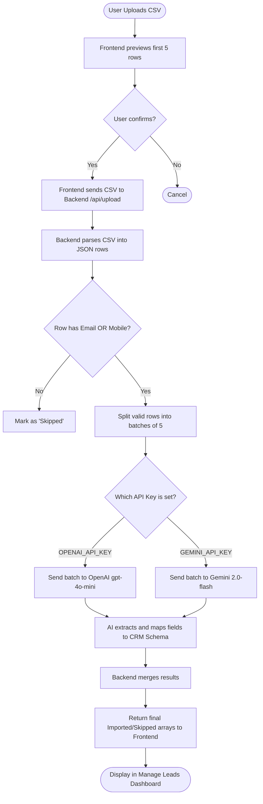

# 🌱 GrowEasy AI-Powered CSV Importer

A modern, full-stack web application that lets you upload any CSV file and uses **Google Gemini AI** or **OpenAI** to intelligently map your columns to GrowEasy CRM fields. Built exactly to the GrowEasy CRM design specifications.

---

## 📖 How It Works (The AI Magic)

The biggest challenge with CSV imports is that every file has different column names. One might say "Phone Number", another might say "Contact", and another might say "Mobile". 

Instead of forcing users to manually map columns, this application uses **Generative AI** (OpenAI / Gemini) to read the context of each row and automatically assign the data to the correct CRM fields.

### 🔄 System Flowchart



---

## ✨ Key Features

- 📂 **Drag & Drop** CSV upload (or click to browse)
- 👁️ **Live preview** of rows before import inside a beautiful modal wizard
- 🤖 **Dual AI Support**: Automatically uses OpenAI or Gemini based on your `.env` keys.
- 🔄 **Safe Batch processing** (5 records per request + delay) to respect free tier limits and avoid rate-limiting errors (`429 Too Many Requests`).
- ⚠️ **Smart validation** – skips records with no email or mobile number locally to save AI tokens.
- 📊 **Dashboard & Results** with imported/skipped breakdown and status charts.
- 🎨 **GrowEasy Theme** with clean white backgrounds, orange accents, glassmorphism, and responsive data tables.

---

## 🛠️ Tech Stack

| Layer | Technology |
|---|---|
| Frontend | Next.js 15, TypeScript, Vanilla CSS (GrowEasy Theme) |
| Backend | Node.js, Express.js |
| AI | OpenAI (gpt-4o-mini) OR Google Gemini (2.0 Flash) |
| File parsing | csv-parser, multer |

---

## 🚀 Getting Started

### 1. Clone / Open the project

```bash
cd "AI-powered CSV"
```

### 2. Set your API Keys

Edit `backend/.env` (Create this file if it doesn't exist). You only need ONE of these keys for the app to work.
```env
# Prefer OpenAI for best results, or use Gemini for free
OPENAI_API_KEY=your_openai_key_here
GEMINI_API_KEY=your_gemini_key_here
PORT=5000
```
- Get OpenAI key: https://platform.openai.com/api-keys
- Get Gemini key: https://aistudio.google.com/app/apikey

### 3. Start the Backend

```bash
cd backend
npm install
node server.js
```
Backend will run at: **http://localhost:5000**

### 4. Start the Frontend

```bash
cd frontend
npm install
npm run dev
```
Frontend will run at: **http://localhost:3000**

---

## 📋 CRM Field Mapping Rules

The AI is strictly prompted to map CSV columns to these exact GrowEasy CRM fields:

- `name`, `email`, `country_code`, `mobile_without_country_code`, `company`, `city`, `state`, `country`, `lead_owner`, `possession_time`, `description`
- `crm_status`: Extrapolates context to match EXACTLY one of: `GOOD_LEAD_FOLLOW_UP`, `DID_NOT_CONNECT`, `BAD_LEAD`, `SALE_DONE`
- `data_source`: Extrapolates context to match EXACTLY one of: `leads_on_demand`, `meridian_tower`, `eden_park`, `varah_swamy`, `sarjapur_plots`
- `created_at`: Formatted strictly to an ISO 8601 date.
- `crm_note`: Any extra emails, secondary phone numbers, or random remarks found in the CSV are intelligently concatenated here.

### Skip Rules
- Records with **no email AND no mobile number** are automatically skipped and displayed in the 'Skipped' tab with a clear error reason.

---

## 📁 Project Structure

```text
AI-powered CSV/
├── frontend/          # Next.js App Router
│   ├── app/           # Pages (/, /dashboard, /manage-leads, etc.)
│   ├── components/    # Reusable UI components
│   ├── contexts/      # React Context for global state
│   └── globals.css    # GrowEasy Design System
├── backend/           # Express.js Server
│   ├── server.js      # Main server + AI routing & batch logic
│   └── .env           # API Keys (Ignored in git)
└── README.md
```

---

## 🔐 Security Notes
- Never commit your `.env` file to version control. The `backend/.gitignore` prevents this.
